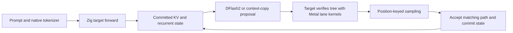

# Native Zig Qwen3.8-27B on Mac

This is a native port of TensorFold's Qwen3.8-27B M5 Metal inference path, following the
Zig → MLX-C → MLX/Metal architecture in the neighboring `mlx-serve` project. Zig owns
loading, tokenization, the forward pass, recurrent/KV caches, DFlash2, tree verification,
and deterministic sampling. The executable does not import or launch Python.

It **uses MLX** for arrays, lazy evaluation, GPU scheduling, safetensors, and ordinary
array operations. TensorFold's specialized Metal kernels perform quantized projections,
normalization, gated DeltaNet, tree attention, and recurrent-state replay. This does not
reimplement Apple's GPU runtime.

## Build and run

Requirements: Zig **0.16.0**, Apple M5-generation GPU, macOS **26.2+**, and a compatible
MLX/MLX-C installation built with Metal tensor support. The tested machine is an M5 Max
with 128 GiB unified memory. The executable rejects older GPUs before loading weights.

From the repository root, using the already-built libraries in `../mlx-serve`:

```sh
mkdir -p build
cp -R ../mlx-serve/lib/mlx build/mlx
zig build
zig build test
zig-out/bin/tensorfold run build/models/Qwen3.8-27B-MLX-4bit \
  --drafter build/models/Qwen3.8-27B-DFlash2 \
  --prompt 'Write a short Python function that computes the Fibonacci sequence.' \
  --max-tokens 128 --seed 1234 --warmup
```

Copy the libraries only once, when `build/mlx` does not yet exist. They have already been
staged in this checkout. The target and drafter have also been downloaded to the paths
above. These are ignored build artifacts, not committed dependencies or weights.

Use `-Dmlx-prefix=/absolute/install/prefix` to link another compatible installation.
The runtime needs `libmlx.dylib`, `libmlxc.dylib`, and `mlx.metallib` together in that
prefix's `lib` directory. Rebuild if the prefix moves; its path is embedded as an rpath.
`zig build -Doptimize=ReleaseSafe` enables runtime safety checks; the default is ReleaseFast.

The target checkpoint is `Vontra/Qwen3.8-27B-MLX-4bit`: sanitized BF16/affine 4-bit,
group size 64. The optional draft checkpoint is `z-lab/Qwen3.8-27B-DFlash2`; its linear
weights are quantized to 4-bit at load. The native loader validates the model recipe.

| CLI option | Behavior |
| --- | --- |
| `--prompt TEXT` | Raw text completion; no chat template is added |
| `--tokens ID,ID,...` | Exact prompt token IDs, overriding text |
| `--max-tokens N` | Maximum output tokens, default 32; stops at model EOS |
| `--drafter DIR` | Enable DFlash2 and context-copy proposals; omit for serial decoding |
| `--temperature T` | Default 1; zero selects greedy decoding |
| `--top-k N`, `--top-p P` | Defaults 20 and 0.95; top-k zero considers the full vocabulary |
| `--seed N` | Override the default SHA-256-derived prompt seed |
| `--warmup` | Compile common Metal variants before timing prompt/decode |
| `--report FILE` | Write prompt/output IDs, decoded text, timing, and token hash as JSON |
| `--dump-logits FILE.npy` | Save float32 logits from the final prompt block |
| `--check-exact` | Run the GPU tree/cache parity check and exit |

Text goes to stdout when decoding finishes; diagnostics go to stderr. Report parent
directories must already exist. Long prompts prefill in 128-token chunks. Prompt plus
requested output is bounded to 262,144 tokens; actual memory requirements grow with context.

## How the port works



The 64 target layers alternate three gated DeltaNet layers with one full-attention
layer. All packed projections use the original Metal lane arithmetic. A verified row
has the same arithmetic regardless of the other rows in its batch. Sampling uses the
same seed/absolute-position/token hash as Python, so a draft token is accepted only when
it matches what serial decoding would select. Rejected branches never enter the cache.

DFlash2 reads five target hidden-state taps and proposes a tree of up to 15 tokens.
Eight-token suffix matches can instead propose copied continuations of up to 31 tokens.
The target verifies both through the same path. Recurrent layers replay only the accepted
path; attention layers gather only its K/V rows.

| File | Responsibility |
| --- | --- |
| `mlx.zig` | Public MLX-C bindings, array ownership, streams, Metal kernel dispatch |
| `weights.zig`, `config.zig` | Checkpoint validation/loading and packed weight preparation |
| `lanes.zig`, `metal/` | Exact quantized projections, normalization, tree metadata and attention |
| `model.zig` | Complete target forward, caches, accepted-path commit |
| `drafter.zig`, `copy.zig` | DFlash2 and context-copy proposals |
| `sampling.zig` | Deterministic greedy/top-k/top-p selection |
| `main.zig` | Native completion CLI and decoding loop |
| `verification.zig` | Branch/partial-commit/continuation/cache parity check |
| `vendor/` | MIT tokenizer and I/O helpers from mlx-serve; preserved license |

The HTTP service, chat-template rendering, vision, disk prefix caches, other model
families, and the M1–M4 SIMD backend are not part of this native port. Attention cache
commit currently concatenates the prefix, so long-context performance needs separate
measurement. This is the native inference backend and completion CLI, not a replacement
for every `tensorfold serve` feature.

## Validation

The checks below use the actual downloaded 27B model, not a toy substitute:

```sh
zig build test
zig-out/bin/tensorfold run build/models/Qwen3.8-27B-MLX-4bit --check-exact
```

`--check-exact` builds a 513-token prefix (crossing the 512-token attention partition),
verifies a branched tree, partially accepts it, and compares continuation logits and
both cached arrays in all 64 layers against serial replay, bit for bit.

For parity with the Python implementation, install this repository's Python development
dependencies into `.venv`, then run:

```sh
mkdir -p build/native-checks
.venv/bin/python tools/export_native_kernels.py --check
.venv/bin/python tools/native_reference.py
zig-out/bin/tensorfold run build/models/Qwen3.8-27B-MLX-4bit \
  --tokens 1,2,3,4 --max-tokens 0 --dump-logits build/native-checks/native.npy
.venv/bin/python tools/native_reference.py \
  --compare build/native-checks/reference.npy build/native-checks/native.npy
```

All **993,280** logits matched exactly. A 128-token sampled code completion also matched
Python serial, Zig serial, and Zig DFlash2 token for token, SHA-256
`e1019b7e85e4bc6858a688dd34c854838412b1b232df1db468dcdcb821750a63`.
The measured warmed M5 Max run took 1.035 s with DFlash2 versus 4.336 s serial
(123.7 vs 29.5 output tokens/s, approximately 4.2×). These are single short-context CLI
runs, not server throughput figures; loading, warm-up, and prefill are excluded.
Separate 64-token checks also matched Python exactly for a Danish prompt with greedy
sampling and a story prompt with seed 5678, temperature 0.7, top-k 12, and top-p 0.8.
The GPU cache check and greedy DFlash2 run also passed in a ReleaseSafe build.

`tools/native_reference.py --generate 128 --output FILE.json` creates the Python
completion report for the default prompt and seed 1234. Use native `--seed 1234 --report`
and compare with `tools/native_reference.py --compare-reports PYTHON SERIAL DRAFT`.
Use the same prompt, seed, sampling settings, and token budget in every run.

The Metal sources are checked in, generated verbatim from Python's lane modules.
After changes there, run `tools/export_native_kernels.py` and repeat the parity checks.
Python is only needed for these development checks and regeneration.

## Build MLX independently

The tested library pairing matches mlx-serve revision
`4e00f2af7a64fd846d31cfaa90247586cf853ca2`:

- MLX: `1f8e74e3f12f31365464a6867c6579f0e9b29d85`
- MLX-C: `56b2d39fc831f2c0eb5bb94d82ef7191f7b31fa6`

With CMake 3.25+, Xcode's macOS 26.2+ SDK and Metal toolchain installed, the following
builds a local prefix without requiring the neighboring repository or administrator access.
Run from the repository root. The clones require GitHub SSH access; CMake also downloads
Apple's Metal C++ headers and the JSON source archive.

```sh
mkdir -p build/deps
git clone git@github.com:ml-explore/mlx.git build/deps/mlx
git -C build/deps/mlx checkout --detach 1f8e74e3f12f31365464a6867c6579f0e9b29d85
git clone git@github.com:ml-explore/mlx-c.git build/deps/mlx-c
git -C build/deps/mlx-c checkout --detach 56b2d39fc831f2c0eb5bb94d82ef7191f7b31fa6
git clone --branch 12.1.0 --depth 1 git@github.com:fmtlib/fmt.git build/deps/fmt
cmake -S build/deps/mlx -B build/mlx-build \
  -DCMAKE_BUILD_TYPE=Release -DCMAKE_OSX_DEPLOYMENT_TARGET=26.2 \
  -DBUILD_SHARED_LIBS=ON -DMLX_BUILD_TESTS=OFF -DMLX_BUILD_EXAMPLES=OFF \
  -DFETCHCONTENT_SOURCE_DIR_FMT="$PWD/build/deps/fmt" \
  -DCMAKE_INSTALL_PREFIX="$PWD/build/mlx"
cmake --build build/mlx-build --parallel 8
cmake --install build/mlx-build
cmake -S build/deps/mlx-c -B build/mlxc-build \
  -DCMAKE_BUILD_TYPE=Release -DCMAKE_OSX_DEPLOYMENT_TARGET=26.2 \
  -DBUILD_SHARED_LIBS=ON -DMLX_C_USE_SYSTEM_MLX=ON -DMLX_C_BUILD_EXAMPLES=OFF \
  -DCMAKE_PREFIX_PATH="$PWD/build/mlx" -DCMAKE_INSTALL_PREFIX="$PWD/build/mlx"
cmake --build build/mlxc-build --parallel 8
cmake --install build/mlxc-build
zig build
```
