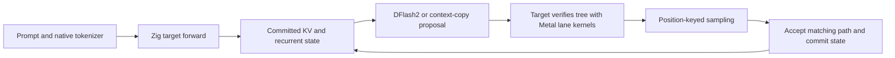

# Native Zig Metal inference on Mac

This is a native port of TensorFold's Qwen3.8-27B, Nemotron Lightning, and Flash Next Metal inference paths, following the
Zig → MLX-C → MLX/Metal architecture in the neighboring `mlx-serve` project. Zig owns
loading, tokenization, the forward pass, recurrent/KV caches, DFlash2, tree verification,
and deterministic sampling. The executable does not import or launch Python.

It **uses MLX** for arrays, lazy evaluation, GPU scheduling, safetensors, and ordinary
array operations. TensorFold's specialized Metal kernels perform quantized projections,
normalization, gated DeltaNet, tree attention, and recurrent-state replay. This does not
reimplement Apple's GPU runtime.

## Build and run

Requirements: Zig **0.17.0-dev.2248+3f6a02acd** (the same nightly as `../mlx-serve`), Apple Silicon, macOS **26.2+**, and a compatible
MLX/MLX-C installation built with Metal tensor support. The tested machine is an M5 Max
with 128 GiB unified memory. M5 uses tensor kernels; older GPUs select SIMD kernels.
The SIMD path can also be exercised on M5 with `--metal-simd`; physical M1–M4 machines
have not been tested for this native port.

From the repository root, using the already-built libraries in `../mlx-serve`:

```sh
mkdir -p build
cp -R ../mlx-serve/lib/mlx build/mlx
bash scripts/fetch-zig.sh
.zig-toolchain/zig build
.zig-toolchain/zig build test
zig-out/bin/tensorfold run build/models/Qwen3.8-27B-MLX-4bit \
  --drafter build/models/Qwen3.8-27B-DFlash2 \
  --prompt 'Write a short Python function that computes the Fibonacci sequence.' \
  --max-tokens 128 --seed 1234 --warmup
```

Copy the libraries only once, when `build/mlx` does not yet exist. They have already been
staged in this checkout. The target and drafter have also been downloaded to the paths
above. These are ignored build artifacts, not committed dependencies or weights.

Use `-Dmlx-prefix=/absolute/install/prefix` to link another compatible installation.
The runtime needs `libmlx.dylib`, `libmlxc.dylib`, and `mlx.metallib` together in that
prefix's `lib` directory. Rebuild if the prefix moves; its path is embedded as an rpath.
`.zig-toolchain/zig build -Doptimize=safe` enables runtime safety checks; the default is `fast`.
The version pin is in `.zig-version`. Zig 0.17 translates the public MLX C header in the
build graph and imports the resulting module; no `@cImport` language builtin is needed.

The target checkpoint is `Vontra/Qwen3.8-27B-MLX-4bit`: sanitized BF16/affine 4-bit,
group size 64. The optional draft checkpoint is `z-lab/Qwen3.8-27B-DFlash2`; its linear
weights are quantized to 4-bit at load. The native loader validates the model recipe.

| CLI option | Behavior |
| --- | --- |
| `--prompt TEXT` | Raw text completion; no chat template is added |
| `--tokens ID,ID,...` | Exact prompt token IDs, overriding text |
| `--max-tokens N` | Maximum output tokens, default 32; stops at model EOS |
| `--drafter DIR` | Enable DFlash2 and context-copy proposals; omit for serial decoding |
| `--mtp-drafts N` | Nemotron/Flash Next: maximum adaptive MTP depth, default 3, maximum 15 |
| `--fixed-drafts` | Use the configured MTP depth each round instead of measured cost/acceptance adaptation |
| `--no-drafts` | Nemotron/Flash Next: disable MTP and decode serially |
| `--full-draft-vocab` | Nemotron/Flash Next: score the full draft head instead of the original reduced ID list |
| `--no-queued-drafts` | Nemotron/Flash Next: read each Metal draft token on the host instead of queuing the chain |
| `--no-early-mtp` | Build MTP context after target verification instead of speculating before its host read |
| `--no-gpu-handoff` | Nemotron: read the queued draft IDs before building target verification |
| `--no-serial-pipeline` | Qwen/Nemotron: disable queuing the next serial Metal step before reading the current token |
| `--no-copy` | Disable context-copy proposals to exercise the neural draft head |
| `--metal-simd` | Force the non-tensor Metal path for coverage on M5 |
| `--metal-sampling` | Use the original fp32 Metal sampler instead of CPU f64 sampling |
| `--temperature T` | Default 1; zero selects greedy decoding |
| `--top-k N`, `--top-p P` | Defaults 20 and 0.95; top-k zero considers the full vocabulary |
| `--seed N` | Override the default SHA-256-derived prompt seed |
| `--warmup` | Compile common Metal variants before timing prompt/decode |
| `--report FILE` | Write prompt/output IDs, decoded text, timing, and token hash as JSON |
| `--dump-logits FILE.npy` | Save float32 logits from the final prompt block |
| `--check-exact` | Run the family's GPU verification/partial-commit parity check and exit |
| `--check-cache-stress` | Check every accepted prefix, cache snapshots, rejection, reset and memory cycles |
| `--check-long-cache` | Repeat cache/rollback checks after random 10K-token or sparse-attention prefixes |
| `--check-mtp-state` | Nemotron/Flash: compare batched MTP with serial, all retained prefixes and continuations through 10K |
| `--check-serial-state` | Qwen/Nemotron: compare pipelined/synchronous tokens, every cache and continuation; add `--check-long-cache` for 10K contexts |
| `--trace-dir DIR` | Flash: save the final prefill block's layer intermediates in an existing directory |
| `--trace-gdn N` | With `--trace-dir`: trace recurrent layer N's input/output across all prefill blocks |

Text goes to stdout when decoding finishes; diagnostics go to stderr. Report parent
directories must already exist. Dense Qwen prefills in 128-token chunks; Nemotron and
Flash Next use 16-token chunks. Prompt plus
requested output is bounded to 262,144 tokens; actual memory requirements grow with context.

## How the port works



The 64 target layers alternate three gated DeltaNet layers with one full-attention
layer. All packed projections use the original Metal lane arithmetic. A verified row
has the same arithmetic regardless of the other rows in its batch. Sampling uses the
same seed/absolute-position/token hash as Python, so a draft token is accepted only when
it matches what serial decoding would select. Rejected branches never enter the cache.

DFlash2 reads five target hidden-state taps and proposes a tree of up to 15 tokens.
Eight-token suffix matches can instead propose copied continuations of up to 31 tokens.
The target verifies both through the same path. Recurrent layers replay only the accepted
path; attention layers gather only its K/V rows.

| File | Responsibility |
| --- | --- |
| `mlx.zig` | Public MLX-C bindings, array ownership, streams, Metal kernel dispatch |
| `weights.zig`, `config.zig` | Checkpoint validation/loading and packed weight preparation |
| `lanes.zig`, `metal/` | Exact quantized projections, normalization, tree metadata and attention |
| `model.zig` | Complete target forward, caches, accepted-path commit |
| `checkpoint.zig` | Shared safetensors reader and affine quantized projections |
| `safetensors.zig`, `ple_tables.zig` | Validated checkpoint headers and bounded positional PLE row reads |
| `schema.zig`, `schemas/` | Required tensor names, shapes and dtypes for all four fixed checkpoint recipes |
| `nemotron.zig` | Mamba, NoPE attention, routed/shared experts, MTP and rollback |
| `flash.zig`, `ngram.zig` | Hyper-connections, GDN, sparse attention, MoE, PLE and MTP |
| `family_runtime.zig` | Chained verification and completion for Nemotron/Flash Next |
| `draft_vocab.zig` | Original reduced draft ID lists, packed head row selection, and ID mapping |
| `mtp_pipeline.zig` | Early MTP speculation, retained-state reuse and queued chains |
| `serial_pipeline.zig` | Queues the next serial step, defers cache evaluation and drains terminal work |
| `draft_depth.zig`, `mtp_calibration.zig` | Original adaptive depth policy and native window/step cost measurements |
| `drafter.zig`, `copy.zig` | DFlash2 and context-copy proposals |
| `sampling.zig` | Deterministic greedy/top-k/top-p selection |
| `main.zig` | Native completion CLI and decoding loop |
| `verification.zig` | Branch/partial-commit/continuation/cache parity check |
| `acceptance.zig`, `cache_checks.zig` | Shared tree/chain acceptance and full-checkpoint cache property tests |
| `variant_checks.zig` | Replay Python fixture launches through the embedded Metal catalog and compare output bits |
| `vendor/` | MIT tokenizer and I/O helpers from mlx-serve; preserved license |

The HTTP service, chat-template rendering, vision, and disk prefix caches are not part
of this native port. Attention cache
commit currently concatenates the prefix, so long-context performance needs separate
measurement. This is the native inference backend and completion CLI, not a replacement
for every `tensorfold serve` feature. Sampling defaults to CPU f64 position-keyed
sampling. `--metal-sampling` selects the original fp32 GPU algorithm (24-bit hash
uniforms and a 1,024-candidate cap); its output need not equal the f64 algorithm.
Draft verification uses the selected sampler consistently. DFlash2 candidate ranking
uses the original BF16 Metal radix top-k kernel. Nemotron uses tensor attention from
10,000 visible keys on M5 and MLX SDPA otherwise.

## Additional model families

Qwen and Nemotron use pipelined serial decoding when Metal sampling is selected and
neural drafting is disabled. The next target forward accepts the current GPU draw
before the host reads it. Cache commits construct replacement graphs without a host
wait; a final drain evaluates any remaining recurrent replay. A queued step beyond
EOS is discarded without committing its cache. `--no-serial-pipeline` retains the
synchronous reference. Reports include `serial_pipeline` and `queued_serial_steps`.
Flash's bounded PLE file reads still require host token IDs, so its serial path does
not yet use this pipeline.

MTP defaults to the original reduced vocabulary: 32,768 Nemotron IDs and 79,592 Flash
IDs (the original 79,591-ID list padded to eight rows). The executable embeds the
original lists at build time and selects the quantized head rows during loading.
Mapped sampling keys noise by the original token ID. The target still verifies every
proposal against the full vocabulary. `--full-draft-vocab` restores the full draft head.
With `--metal-sampling`, dependent MTP proposals stay on the GPU for the whole chain;
`--no-queued-drafts` restores per-token reads. Nemotron feeds that array directly into
target verification and reads proposals together with target draws; `--no-gpu-handoff`
restores the earlier synchronization. Flash reads the chain before its bounded PLE
file lookups. Reports count actual GPU handoffs in `gpu_handoff_rounds`. CPU sampling uses host
reads. With Metal sampling, target samples also feed a batched MTP pass before the
host reads verification results. The accepted MTP cache prefix and its last draw are
reused for the next chain; `--no-early-mtp` disables this overlap. MTP depth adapts using
the original per-depth acceptance/cost policy. Startup measures native target widths
and a head step; `--fixed-drafts` skips calibration and fixes the depth for diagnostics.
Calibration time is recorded separately in JSON. The [runtime audit](RUNTIME_AUDIT.md)
records remaining scheduling and arithmetic differences.

All four required checkpoints are downloaded under ignored `build/models/` in this
checkout, including Nemotron's `mtp-4bit.safetensors` and all 22 Flash Next shards:

| Checkpoint directory | Native inference components |
| --- | --- |
| `Qwen3.8-27B-MLX-4bit` + `Qwen3.8-27B-DFlash2` | GDN, full attention, dense MLP, DFlash2 trees, context copies, recurrent replay |
| `NVIDIA-Nemotron-3.5-Lightning-30B-A3B-MLX-4bit` | Mamba convolution/SSM, NoPE attention, top-6 routed and shared experts, MTP |
| `Qwen3.8-Flash-Next-MLX-4bit-MTP` | Four residual streams, hyper-connections, GDN, indexed sparse attention, top-10 MoE, PLE hash/lookup/convolution, MTP |

```sh
zig-out/bin/tensorfold run build/models/NVIDIA-Nemotron-3.5-Lightning-30B-A3B-MLX-4bit \
  --prompt 'Write a short Python function that computes the Fibonacci sequence.' --seed 1234
zig-out/bin/tensorfold run build/models/Qwen3.8-Flash-Next-MLX-4bit-MTP \
  --tokens 1,2,3,4 --max-tokens 16 --seed 1234
```

Flash Next contains approximately 113 GB of tensor data. Native PLE lookup reads only
the selected packed rows from disk, then dequantizes those rows through MLX; it avoids
loading the complete 32 GB table. Active MLX allocations settled at 79.02 GB in the
cache stress check on this 128 GiB Mac. Long-context qualification and final performance
comparisons remain separate checks. The upstream recommended capacity is 192 GB or more.

## Validation

The checks below use the actual downloaded 27B model, not a toy substitute:

```sh
.zig-toolchain/zig build test
zig-out/bin/tensorfold run build/models/Qwen3.8-27B-MLX-4bit --check-exact
```

`--check-exact` builds a 513-token prefix (crossing the 512-token attention partition),
verifies a branched tree, partially accepts it, and compares continuation logits and
both cached arrays in all 64 layers against serial replay, bit for bit.

For parity with the Python implementation, install this repository's Python development
dependencies into `.venv`, then run:

```sh
mkdir -p build/native-checks
.venv/bin/python tools/export_native_kernels.py --check
.venv/bin/python tools/native_reference.py
zig-out/bin/tensorfold run build/models/Qwen3.8-27B-MLX-4bit \
  --tokens 1,2,3,4 --max-tokens 0 --dump-logits build/native-checks/native.npy
.venv/bin/python tools/native_reference.py \
  --compare build/native-checks/reference.npy build/native-checks/native.npy
```

All **993,280** logits matched exactly. A 128-token sampled code completion also matched
Python serial, Zig serial, and Zig DFlash2 token for token, SHA-256
`e1019b7e85e4bc6858a688dd34c854838412b1b232df1db468dcdcb821750a63`.
The measured warmed M5 Max run took 1.035 s with DFlash2 versus 4.336 s serial
(123.7 vs 29.5 output tokens/s, approximately 4.2×). These are single short-context CLI
runs, not server throughput figures; loading, warm-up, and prefill are excluded.
Separate 64-token checks also matched Python exactly for a Danish prompt with greedy
sampling and a story prompt with seed 5678, temperature 0.7, top-k 12, and top-p 0.8.
The GPU cache check and greedy DFlash2 run also passed in a ReleaseSafe build.

Nemotron's four-token pass matched all **524,288 logits** from Python exactly; its
32-token sampled MTP completion matched Python serial. Both tensor and forced SIMD
window/partial-commit checks passed, including all 52 layer caches. Flash Next's
one-token full pass matched all **248,320 logits** exactly. Its 16-token MTP output
matched Python serial, and verified rows, rollback continuation and all 48 layer
caches matched native serial. Dense Qwen's forced SIMD tree/cache check passed on M5.
Embedded kernels alone are not counted as execution coverage.
The forced SIMD DFlash2 path also produced the same 128 sampled tokens as SIMD serial
with Metal sampling enabled. Nemotron's GPU-sampled MTP output matched the original
Python GPU sampler and serial engine for the 32-token check.

The build exposes reproducible coverage targets:

```sh
.zig-toolchain/zig build test -Doptimize=safe
.zig-toolchain/zig build test-metal -Doptimize=safe -Dmetal-tensors=true
.zig-toolchain/zig build test-variants -Doptimize=safe
.zig-toolchain/zig build test-allocation-failures -Doptimize=safe
.zig-toolchain/zig build test-draft-vocab -Doptimize=safe
.zig-toolchain/zig build test-draft-depth -Doptimize=safe
.zig-toolchain/zig build test-mtp-positions -Doptimize=safe
.zig-toolchain/zig build test-mtp-state -Doptimize=safe
.zig-toolchain/zig build test-mtp-runtime
.zig-toolchain/zig build test-serial-pipeline -Doptimize=safe
.zig-toolchain/zig build test-serial-pipeline -Doptimize=safe -Dserial-long=true
.zig-toolchain/zig build test-serial-runtime -Doptimize=safe
.zig-toolchain/zig build test-kv-buffers -Doptimize=safe
.zig-toolchain/zig build test-kv-buffers -Doptimize=safe -Dkv-long=true
.zig-toolchain/zig build test-kv-runtime -Doptimize=safe
.zig-toolchain/zig build test-nemotron-simd-reference -Doptimize=safe
.zig-toolchain/zig build test-models -Doptimize=safe
.zig-toolchain/zig build test-cache-stress -Doptimize=safe
.zig-toolchain/zig build test-drafts -Doptimize=safe
.zig-toolchain/zig build test-checkpoint-files -Doptimize=safe
.zig-toolchain/zig build test-model-schemas test-schema-failures -Doptimize=safe
.zig-toolchain/zig build test-long-context -Doptimize=safe
.zig-toolchain/zig build test-long-cache -Doptimize=safe
.zig-toolchain/zig build test-ple -Doptimize=safe
```

`test-metal` generates independent oracles through the original Python implementation
and runs native comparisons: 76 CPU/Metal sampling/top-k cases, three sparse-attention threshold
cases with every row and rollback continuation checked, and six tensor-attention
cases including 128-wide heads and 10K-token strided caches, plus 36 PLE normalization
cases that detect the former fused-reduction substitution. Omit `-Dmetal-tensors=true`
on M1–M4. `test-models` loads the downloaded models sequentially and checks every
family's caches; it also forces the dense Qwen and Nemotron SIMD paths. It requires
the large checkpoints and enough unified memory. See [COVERAGE.md](COVERAGE.md).

`test-variants` runs upstream kernel assertions and additional boundary fixtures, then
replays 1,104 captured launches through 54 native embedded variants. It covers optional
fused/row paths, scalar and matrix SIMD, grouped experts, routing ties and quantization
boundaries. All outputs match bit for bit. Diagnostic coverage does not make each
variant a selectable production mode; [COVERAGE.md](COVERAGE.md) records that distinction.
The full [86-kernel inventory](KERNEL_INVENTORY.md) lists integration sites and fixture counts.

`test-allocation-failures` injects 904 failures into native ownership operations with
real MLX handles and small checkpoint files. Every allocation is released, with zero
retained MLX active memory. It also tests API error recovery; MLX's internal allocator
and the driver are outside this injection boundary.

Attention caches alternate capacity buffers, growing in blocks of 2,048 rows. The
committed prefix and retained snapshots remain protected by MLX ownership; rejected
rows are overwritten before reuse. Qwen's branched commits gather the selected path.
Flash also buffers raw index keys. `--no-kv-buffers` restores concatenation for direct
comparison; JSON reports include `kv_buffers`.

`test-kv-buffers` compares independently-prefilled caches and all verification logits
against concatenation, then observes real-model allocation reuse. Add `-Dkv-long=true`
for attention threshold contexts or `-Dkv-family=0|1|2` for Qwen/Nemotron/Flash. Its
isolated donation fixture drains Metal completion callbacks before requiring the same
allocation address; production inference does not add that synchronization. Retained
or busy buffers can legitimately require a copy. `test-kv-runtime` compares actual
serial, DFlash2 and fixed-depth MTP CLI output, proposal hashes and schedule counters
with buffers enabled and disabled.

`test-draft-vocab` compares every selected packed head row and mapped ID with original
Python row selection. `test-mtp-runtime` compares serial output against full/cut head
and queued/host proposal modes at budgets 1/3/15, with greedy, Metal and CPU sampling.
Queued/host and early/late comparisons also check the SHA-256 of every proposal window,
round counts and accepted drafts. Adaptive runs independently compare against serial.
Select one family with `-Dmtp-family=nemotron` or `flash`.

`test-draft-depth` checks 12,288 choices and acceptance updates against the original
Python policy, including missing costs, zero/maximum budgets and periodic probes.
`test-mtp-positions` checks 360 proposal/retained-row fixtures through Python's actual
`speculate` and `settle` methods with an identity MTP block. It detects the former
one-position-ahead draft noise. Model arithmetic is separate: `test-mtp-state` passes
414 real-checkpoint MTP prefix/cache/continuation comparisons across three backends,
including sparse pooling and 10K attention transitions. Flash windows with 64 residual
stream rows split into row-exact projections instead of falling back to MLX matmul.

`test-checkpoint-files` runs without a GPU and exercises positional reads, truncation,
oversized or invalid headers, missing files and allocation failures. The loader validates
header geometry and byte offsets before passing any checkpoint to MLX. `test-ple`
compares five rows at the beginning, middle and end of every PLE shard against an
independent MLX load/dequantization, freeing each oracle shard before proceeding.

`test-model-schemas` checks all 6,105 required tensors using headers only. The same
metadata contracts run in production before model transformations or kernel dispatch.
`test-schema-failures` exercises 38 missing-file/tensor/MTP, malformed-index, truncation,
shape, rank and dtype failures through the native metadata CLI. It creates sparse
fixtures under `build/native-checks`; original model files are never changed.
Regenerate schemas with `tools/export_native_schemas.py`; `--check` verifies them.
The long-context targets test Qwen/Nemotron around 10K tokens and Flash around the
sparse-attention threshold. See [COVERAGE.md](COVERAGE.md) for current execution results.

`tools/native_reference.py --generate 128 --output FILE.json` creates the Python
completion report for the default prompt and seed 1234. Use native `--seed 1234 --report`
and compare with `tools/native_reference.py --compare-reports PYTHON SERIAL DRAFT`.
Use the same prompt, seed, sampling settings, and token budget in every run.

The Metal sources are checked in, generated verbatim from Python's lane modules.
After changes there, run `tools/export_native_kernels.py` and repeat the parity checks.
Python is only needed for these development checks and regeneration.

## Build MLX independently

The tested library pairing matches mlx-serve revision
`4e00f2af7a64fd846d31cfaa90247586cf853ca2`:

- MLX: `1f8e74e3f12f31365464a6867c6579f0e9b29d85`
- MLX-C: `56b2d39fc831f2c0eb5bb94d82ef7191f7b31fa6`

With CMake 3.25+, Xcode's macOS 26.2+ SDK and Metal toolchain installed, the following
builds a local prefix without requiring the neighboring repository or administrator access.
Run from the repository root. The clones require GitHub SSH access; CMake also downloads
Apple's Metal C++ headers and the JSON source archive.

```sh
mkdir -p build/deps
git clone git@github.com:ml-explore/mlx.git build/deps/mlx
git -C build/deps/mlx checkout --detach 1f8e74e3f12f31365464a6867c6579f0e9b29d85
git clone git@github.com:ml-explore/mlx-c.git build/deps/mlx-c
git -C build/deps/mlx-c checkout --detach 56b2d39fc831f2c0eb5bb94d82ef7191f7b31fa6
git clone --branch 12.1.0 --depth 1 git@github.com:fmtlib/fmt.git build/deps/fmt
cmake -S build/deps/mlx -B build/mlx-build \
  -DCMAKE_BUILD_TYPE=Release -DCMAKE_OSX_DEPLOYMENT_TARGET=26.2 \
  -DBUILD_SHARED_LIBS=ON -DMLX_BUILD_TESTS=OFF -DMLX_BUILD_EXAMPLES=OFF \
  -DFETCHCONTENT_SOURCE_DIR_FMT="$PWD/build/deps/fmt" \
  -DCMAKE_INSTALL_PREFIX="$PWD/build/mlx"
cmake --build build/mlx-build --parallel 8
cmake --install build/mlx-build
cmake -S build/deps/mlx-c -B build/mlxc-build \
  -DCMAKE_BUILD_TYPE=Release -DCMAKE_OSX_DEPLOYMENT_TARGET=26.2 \
  -DBUILD_SHARED_LIBS=ON -DMLX_C_USE_SYSTEM_MLX=ON -DMLX_C_BUILD_EXAMPLES=OFF \
  -DCMAKE_PREFIX_PATH="$PWD/build/mlx" -DCMAKE_INSTALL_PREFIX="$PWD/build/mlx"
cmake --build build/mlxc-build --parallel 8
cmake --install build/mlxc-build
.zig-toolchain/zig build
```
